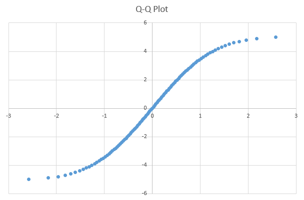

## Q-Q Plot 그리는 방법

Q-Q Plot을 그리는 방법은 [엑셀에서 Q-Q 플롯 그리기](https://loadtoexcelmaster.tistory.com/entry/%EC%97%91%EC%85%80%EC%97%90%EC%84%9C-Q-Q%ED%94%8C%EB%A1%AFQ-Q-Plot-%EA%B7%B8%EB%A6%AC%EA%B8%B0)를 참고하였습니다.

위 내용을 요약하면 아래 순서와 같습니다.

1. CSV 테스트 데이터(QQTest.csv) 읽어온다.
1. 오름차순 정렬
1. 순위(Rank) 계산
1. 백분위 계산
1. Z-Score 계산
   - 엑셀에서의 NORM.S.INV 함수
   - MATH.NET NuGet의 InverseCumulativeDistribution()사용
       - [InverseCumulativeDistribution](https://numerics.mathdotnet.com/api/MathNet.Numerics.Distributions/Normal.htm#InverseCumulativeDistribution)
1. X축은 5번(z-score)의 데이터, Y축(정렬한 데이터)은 2번의 데이터

## Code

```CS
// 1. 데이터 읽어오기
var projectDir = Directory.GetParent(Environment.CurrentDirectory).Parent.FullName;
string filePath = Path.Combine(projectDir, "QQTest.csv");

StreamReader sr = new StreamReader(filePath, Encoding.GetEncoding("euc-kr"));
List<double> numbers = new List<double>();
while (!sr.EndOfStream)
{
    string s = sr.ReadLine();
    string[] temp = s.Split(',');        
    numbers.Add(double.Parse(temp[0]));
}

// 2. 오름차순 정렬
numbers.Sort();

// 3. 순위(Rank) 계산
var numberCount = numbers.Count;
List<double> ranks = new List<double>(); 
for (int i = 1; i < numberCount + 1; i++)
{
    ranks.Add(i);
}

// 4. 백분위 계산
List<double> percentiles = new List<double>();         
foreach (var rank in ranks)
{
    var percentile = (rank - 0.5) / numberCount;
    percentiles.Add(percentile);
}

// 5. Z-Score 계산
// 표준 정규 누적 분포 역함수 : NORM.S.INV
// MATH.NET NuGet 사용
List<double> normStandardInverses = new List<double>();
foreach (var percentile in percentiles)
{
    var normal = new Normal();
    double value = normal.InverseCumulativeDistribution(percentile);
    normStandardInverses.Add(value);
}

// 6. Q-Q Plot X, Y값 확인 
var xData = normStandardInverses;
var yData = numbers;
```

만들어진 `xData` 및 `yData`로 차트 라이브러리를 이용해 Q-Q Plot을 그리면 됩니다.

